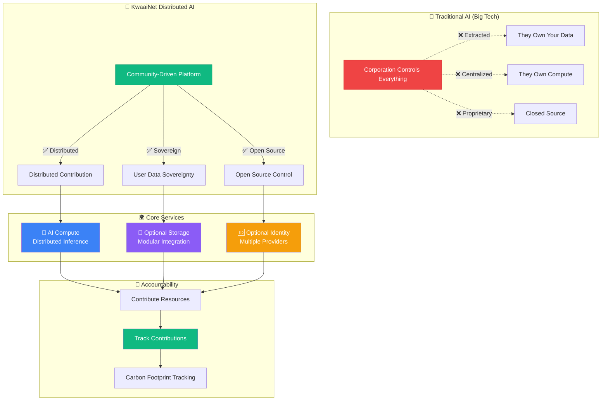
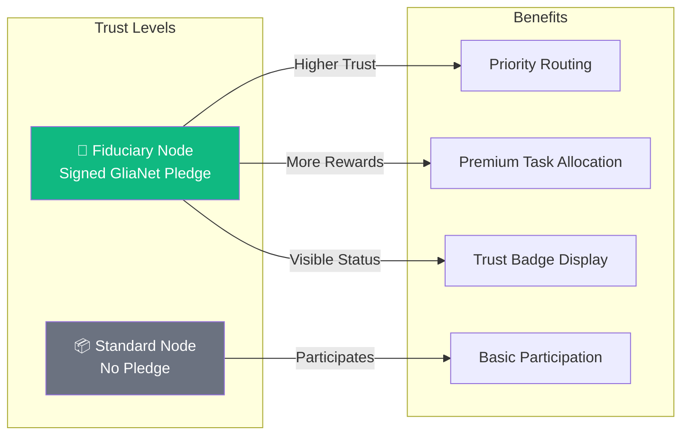

# KwaaiNet

[](https://youtu.be/ES9iQWkAFeY)

KwaaiNet is a decentralized AI node architecture for **Layer 8** — the trust and intelligence layer above the traditional network stack — built by the [Kwaai Foundation](https://www.kwaai.ai), a 501(c)(3) nonprofit AI lab focused on democratizing AI.

Each KwaaiNet node combines:

- A **decentralized trust graph** (cryptographic identity, verifiable credentials, local trust scores).
- **Shared, sharded LLM compute** over heterogeneous CPUs/GPUs using Petals-style distributed inference. Apple Silicon Macs use llama.cpp with Metal for 30+ tok/s local inference; Linux nodes use CUDA-accelerated block sharding.
- **Secure multi-tenant knowledge storage** via Virtual Private Knowledge (VPK) with encrypted vector search.
- **Intent-based, peer-to-peer networking** that routes based on "what I need" (model, trust tier, latency), not just IP addresses.

From an app's point of view, KwaaiNet looks like a familiar chat-completion style HTTP API. Under the hood, it is a person-anchored Layer 8 fabric where every node is tied to an accountable human or organization.

---

## Why KwaaiNet?

Today's "Layer 8" — the AI and agent layer that mediates how people see information and act in the world — is mostly provided by closed platforms you rent and cannot inspect.

KwaaiNet offers an alternative:

- **Owners, not renters** — Run intelligent agents on infrastructure you and your community own and govern, instead of renting access to proprietary stacks.
- **Trust-first, not anonymous compute** — Every node carries an Ed25519-anchored identity, W3C Verifiable Credentials, and a local, time-decayed trust score; there is no central trust registry.
- **Knowledge as a first-class, private citizen** — VPK lets you shard encrypted knowledge across nodes and query it without exposing raw content.
- **Intent-based networking** — Nodes route requests based on intents like "model X, minimum trust tier Verified, max latency Y," making the network semantic and economic, not just transport. See [docs/network-and-intent-routing.md](docs/network-and-intent-routing.md) for the full intent lifecycle.

For the full architectural and philosophical context, see:

- **Layer 8: The Decentralized AI Trust Layer** (whitepaper) — available via the [Kwaai website](https://www.kwaai.ai/kwaainet).
- **KwaaiNet: Decentralized AI Node Architecture for Layer 8** (technical architecture) — available via the [Kwaai website](https://www.kwaai.ai/kwaainet).

---

## Project status: where we are now

KwaaiNet is under active development. The Rust CLI and node implementation already ship many core capabilities; others are in progress or still research.

Today, a KwaaiNet node can:

- Run as a native Rust binary (`kwaainet`) with pre-built cross-platform releases.
- Generate a persistent Ed25519 keypair at `~/.kwaainet/identity.key` and derive a stable `PeerId` / `did:peer:` DID.
- Maintain a local W3C Verifiable Credential wallet under `~/.kwaainet/credentials/` with credential types like `FiduciaryPledgeVC`, `VerifiedNodeVC`, `UptimeVC`, `ThroughputVC`, `EventAttendeeVC`, and `PeerEndorsementVC`.
- Compute a local, time-decayed trust score for peers, grouped into tiers (`Unknown`, `Known`, `Verified`, `Trusted`).
- Join a libp2p + Kademlia DHT swarm compatible with Petals/Hivemind for node discovery and health checks.
- Serve and consume **block-sharded LLM inference** (CandelEngine): SafeTensors loading, RoPE, GQA, SwiGLU, per-session KV-cache, and temperature/top-k/top-p sampling, exposed through an OpenAI-compatible HTTP API.
- Run **distributed inference across multiple machines** with session-pinned peer paths that keep KV-caches coherent, automatic gap-filling, and graceful failover when peers go offline.
- Download models selectively with `kwaainet shard download --start-block N --blocks M` — fetch only the weight files needed for your block range (10x reduction for large models).
- **Dual inference backends**: llama.cpp with Metal GPU for 30+ tok/s on Apple Silicon (GGUF models); candle with CUDA for distributed block sharding on Linux.
- **llama.cpp fast path**: when a Mac node hosts the full model and a GGUF file is available, the OpenAI API and benchmark automatically bypass the distributed shard engine and use llama.cpp with Metal — delivering 36+ tok/s instead of ~5 tok/s on CPU. Auto-detected from Ollama, `--ollama-model`, `--gguf-path`, or `~/.kwaainet/models/`.
- Pre-form **inference circuits** (`kwaainet shard circuit create`) for stable, reusable peer paths across multiple chat completions.
- Auto-detect local models and network state to smart-select what to serve, and appear on the public map when properly configured at [map.kwaai.ai](https://map.kwaai.ai).

See the [latest GitHub Release](https://github.com/Kwaai-AI-Lab/KwaaiNet/releases/latest) for the most recent feature list and release notes.

---

## Quickstart: run a node and make a request

This quickstart shows how to install the native Rust CLI, start a node, and send a simple chat-completion request against its OpenAI-compatible endpoint.

> **Note:** Exact flags and defaults may evolve. Check `kwaainet --help` for current options.

### 1. Install the `kwaainet` CLI

**Shell installer (macOS / Linux):**

```bash
curl --proto '=https' --tlsv1.2 -LsSf https://github.com/Kwaai-AI-Lab/KwaaiNet/releases/latest/download/kwaainet-installer.sh | sh
```

**PowerShell installer (Windows):**

```powershell
powershell -ExecutionPolicy Bypass -c "irm https://github.com/Kwaai-AI-Lab/KwaaiNet/releases/latest/download/kwaainet-installer.ps1 | iex"
```

**Homebrew (macOS / Linux — optional):**

```bash
brew install kwaai-ai-lab/tap/kwaainet
```

**cargo binstall (downloads prebuilt binary):**

```bash
cargo binstall kwaainet
```

**Nix (reproducible build):**

```bash
nix build github:Kwaai-AI-Lab/KwaaiNet
./result/bin/kwaainet --help
```

Or enter a development shell with all dependencies pinned:

```bash
nix develop github:Kwaai-AI-Lab/KwaaiNet
```

See **[nix/README.md](nix/README.md)** for the full Nix guide.

**RISC-V (cross-compile via Nix):**

```bash
nix build github:Kwaai-AI-Lab/KwaaiNet#kwaainet-riscv64-linux-gnu
file result-kwaainet-riscv64-linux-gnu/bin/kwaainet
# → ELF 64-bit LSB pie executable, UCB RISC-V
```

Copy the binary to your RISC-V board and run. See **[nix/README.md](nix/README.md)** for all cross-compilation targets (aarch64-musl, x86_64-musl, riscv64-gnu).

**Build from source:**

```bash
cargo install --git https://github.com/Kwaai-AI-Lab/KwaaiNet kwaainet
```

Then confirm:

```bash
kwaainet --help
```

**GPU support (NVIDIA CUDA):**

On Linux and Windows machines with an NVIDIA GPU, the installer automatically detects the GPU and installs the CUDA-enabled build with bundled runtime libraries — no CUDA toolkit installation required. Verify with:

```bash
kwaainet benchmark --gpu
```

**Apple Silicon (Metal):**

On macOS with a GGUF model available (via Ollama or `~/.kwaainet/models/`), the benchmark and API server automatically use llama.cpp with Metal GPU acceleration:

```bash
ollama pull llama3.1:8b    # download a GGUF model
kwaainet benchmark         # auto-detects GGUF → 36+ tok/s via Metal
```

To check how many model blocks your hardware can serve:

```bash
kwaainet calibrate
```

This reports GPU name, VRAM, and recommended block counts based on your hardware capacity.

### 2. Initialize and start a node

Initialize node identity and config:

```bash
kwaainet setup
```

This generates `~/.kwaainet/identity.key` (Ed25519 keypair) and creates a default config with a smart default node name (e.g. `alice-linux-aarch64`).

> If `kwaainet start` reports that `p2pd` is missing (e.g. manual install from a `.tar.xz`), run `kwaainet setup --get-deps` to download and install it automatically.

Start the node:
- ✅ **Smart Default Node Name** — `kwaainet setup` now generates `{USER}-{OS}-{ARCH}` (e.g. `alice-linux-aarch64`) instead of `anonymous@kwaai`, making nodes identifiable on the map without manual configuration
- ✅ **v0.1.1 Released** — first public release with native pre-built binaries for all four platforms; install cycle validated stop → download → install → node on map in ~46 s (no build tools required)
- ✅ **One-Command Install** — `curl -fsSL .../install.sh | bash` auto-detects platform, installs binaries, runs setup + benchmark, and starts the node; tested on macOS and Linux
- ✅ **All Four Platform Binaries Tested** — macOS Apple Silicon (M4) and macOS Intel built and tested natively; Linux x86_64 built and tested by Metro on a remote machine; Windows x86_64 (Intel NUC) built and uploaded — all nodes confirmed live on [map.kwaai.ai](https://map.kwaai.ai)
- ✅ **VPK P2P Vector Database Integration (Phase 1)** — `kwaainet vpk enable/disable/status/discover` commands; nodes advertise VPK capability via `_kwaai.vpk.nodes` DHT key; per-block `vpk` field added to DHT announcements; bridges KwaaiNet nodes to the PHE/VPK encrypted vector database
- ✅ **Decentralized Trust Graph** — `kwaai-trust` crate implements the ToIP/DIF DTG framework: W3C Verifiable Credentials, `did:peer:` DIDs derived from libp2p PeerIds, Ed25519 signature verification, credential storage at `~/.kwaainet/credentials/`, weighted trust scoring with time-decay, and `kwaainet identity` CLI commands. Trust attestations are included in DHT announcements; map.kwaai.ai can now display trust badges alongside nodes
- ✅ **Persistent Node Identity** — each node generates and stores a permanent Ed25519 keypair at `~/.kwaainet/identity.key`; the same `PeerId` (and `did:peer:`) is used across restarts, making Verifiable Credentials meaningful
- ✅ **Bootstrap Resilience** — node announces to all configured bootstrap peers in parallel; if the primary is down the secondary takes over automatically, so `kwaainet start` succeeds even when `bootstrap-1` is unreachable
- ✅ **`kwaainet start --daemon`** — one command starts a fully managed background node, confirmed **online** on [map.kwaai.ai](https://map.kwaai.ai)
- ✅ **`kwaainet serve`** — OpenAI-compatible API server (`/v1/models`, `/v1/chat/completions`, `/v1/completions` with SSE streaming); any OpenAI client library works out of the box
- ✅ **GGUF Tokenizer Special Tokens Fixed** — control tokens (e.g. `<|eot_id|>`) are now registered as `added_tokens` in the HuggingFace tokenizer; generation stops correctly at EOS instead of running to the token limit and leaking raw special-token strings into responses
- ✅ **Native Rust CLI** — `kwaainet` binary runs nodes directly via `kwaai-p2p` + `kwaai-hivemind-dht` (no Python required)
- ✅ **Smart Model Selection** — reads the live network map at startup, cross-references locally installed Ollama models, and auto-selects the best model to serve (most popular on the network that you have locally)
- ✅ **Canonical DHT Prefix** — uses the map's official `dht_prefix` (e.g. `Llama-3-1-8B-Instruct-hf`) so your node joins the correct swarm instead of creating a broken separate entry
- ✅ **Metal GPU Inference** — native Apple Silicon GPU acceleration via candle + Metal; **33+ tok/s** on M4 Pro with GGUF Q4_K_M
- ✅ **`kwaainet benchmark`** — fast throughput measurement (warm-up + 20 timed decode steps, completes in <1 s) saved to cache for accurate DHT announcements
- ✅ **Direct Connection Detection** — announces `using_relay: false` when a public IP is configured, giving full throughput credit on the map
- ✅ **Full Petals/Hivemind DHT Compatibility** — DHT announcements, RPC health checks, 120-second re-announcement
- 🌐 **Live Node**: `KwaaiNet-RUST-Node` serving `Llama-3.1-8B-Instruct` blocks 0–7 at **33.2 tok/s**

**What This Means:** Download a single archive for your platform, run `kwaainet setup` once, and `kwaainet start --daemon` launches a production-ready distributed AI node in the background. No Python, no build tools, no configuration required. The node reads the network map, picks the best locally-available model, joins the correct DHT swarm, and appears on [map.kwaai.ai](https://map.kwaai.ai) — all in native Rust.

## Vision

KwaaiNet is creating a new paradigm for AI infrastructure - one where users maintain complete sovereignty over their computational contributions and personal data. We're building an open-source distributed AI platform that combines:

- **Decentralized AI Compute**: Distributed inference across millions of devices
- **Privacy-First Architecture**: User-controlled data processing
- **Modular Integration**: Support for various storage/identity systems
- **Environmental Accountability**: Carbon-negative computing tracking

KwaaiNet is open-source infrastructure built collaboratively and owned by no single entity.

https://youtu.be/ES9iQWkAFeY



**The shift is simple**: Instead of Big Tech controlling AI infrastructure, the community builds and maintains it collaboratively.

---

## Guiding Principles: GliaNet Fiduciary Pledge

Kwaai is a proud signatory of the [**GliaNet Fiduciary Pledge**](https://www.glianetalliance.org/pledge), committing KwaaiNet to the highest standards of user protection. This pledge becomes a foundational principle for the entire network.

### The PEP Model
 

### Node Operator Trust Hierarchy

The GliaNet Fiduciary Pledge is **optional for node operators** but directly impacts network trust:



**Fiduciary Nodes** that sign the pledge receive:
- 🏅 **Trust Badge**: Visible "GliaNet Fiduciary" status on the network map
- ⚡ **Priority Routing**: Preferred for sensitive/enterprise workloads
- 🎯 **Enhanced Reputation**: `FiduciaryPledgeVC` adds 0.30 to the node's trust score (the single highest-weight credential)
- 🤝 **Enterprise Eligibility**: Required for GDPR/HIPAA compliant workloads

The pledge is enforced via the trust graph: signing generates a `FiduciaryPledgeVC` issued by the GliaNet Foundation and stored in the node's credential wallet. The credential travels with the node in every DHT announcement. Violation triggers VC revocation, immediately dropping the node's trust score.

> *"By signing the GliaNet Fiduciary Pledge, node operators commit to putting users first—protecting their data, enhancing their experience, and promoting their interests above all else."*

---

## Decentralized Trust Graph (DTG)

KwaaiNet implements the [ToIP/DIF Decentralized Trust Graph](https://trustoverip.org) framework — a four-layer model that gives every node a portable, verifiable reputation without any central authority.

### Layer 1 — Identity (already live)

Every node's libp2p `PeerId` (Ed25519 keypair) is a self-certifying identity anchor, functionally equivalent to a `did:key`. KwaaiNet exposes it as a `did:peer:` DID:

```
did:peer:QmYyQSo1c1Ym7orWxLYvCuxRjeczyuq4GNGbMaFfkMhp4
```

The keypair is persisted at `~/.kwaainet/identity.key` so the DID is stable across restarts.

### Layer 2 — Verifiable Credentials

Credentials are cryptographically signed W3C VCs, stored at `~/.kwaainet/credentials/` and included in DHT announcements.

| Credential | Issuer | What it proves | Phase |
|------------|--------|----------------|-------|
| `SummitAttendeeVC` | Kwaai summit server | Attended a Kwaai Personal AI Summit | **1 — live** |
| `FiduciaryPledgeVC` | GliaNet Foundation | Signed the GliaNet Fiduciary Pledge | 2 |
| `VerifiedNodeVC` | Kwaai Foundation | Passed node onboarding checks | 2 |
| `UptimeVC` | Bootstrap servers | Observed uptime ≥ threshold over N days | 3 |
| `ThroughputVC` | Peer nodes | Peer-witnessed throughput within X% of announced | 3 |
| `PeerEndorsementVC` | Any node | "I have transacted with this node reliably" | 4 |

### Layer 3 — Trust Scoring

```
NodeTrustScore = Σ weight(VC_type) × 0.5^(age_days/365)
```

| Score | Tier | Typical credentials |
|-------|------|---------------------|
| ≥ 0.70 | **Trusted** | FiduciaryPledge + VerifiedNode + Uptime |
| ≥ 0.40 | **Verified** | VerifiedNode present |
| ≥ 0.10 | **Known** | SummitAttendee or similar |
| < 0.10 | **Unknown** | No recognised credentials |

Scores are **local to the querier** — your trust graph may differ from mine. A node's earned VCs travel with it if it changes infrastructure. Phase 4 adds full EigenTrust propagation (Sybil-resistant through endorsement-weight decay).

### Layer 4 — Governance

- **Trusted issuers**: GliaNet Foundation (FiduciaryPledge), Kwaai Foundation (VerifiedNode), bootstrap servers (Uptime/Throughput)
- **Revocation**: `FiduciaryPledgeVC` can be revoked if the pledge is violated
- **Enterprise routing**: minimum trust score thresholds for HIPAA/GDPR workloads (Phase 2)

### `kwaainet identity` commands

```bash
kwaainet start --daemon --shard
```

The node will:

- Connect to bootstrap peers and announce itself on the DHT.
- Auto-detect available hardware and serve the optimal block range for your machine.
- Load or download the required model shards.
- Expose an HTTP API compatible with the OpenAI chat-completion interface.

### 3. Call the OpenAI-compatible API

```bash
curl http://localhost:11435/v1/chat/completions \
  -H "Content-Type: application/json" \
  -d '{
    "model": "your-model-id",
    "messages": [
      {"role": "user", "content": "Hello, KwaaiNet!"}
    ]
  }'
```

This sends a chat-completion request to your local node, which may route it through a shard chain of other nodes depending on configuration and trust requirements.

For a full walkthrough including platform specifics, model discovery, and Python/JS examples see **[docs/getting-started-node.md](docs/getting-started-node.md)** and **[docs/api-quickstart.md](docs/api-quickstart.md)**.

### 4. Distributed inference across the network

Download the model (or just the blocks you need):

```bash
kwaainet shard download
```

Run inference across the live KwaaiNet peer network:

```bash
kwaainet shard run "What is the capital of France?"
```

The coordinator discovers block servers via DHT, pins a stable peer path for the session, and forwards activations through the chain:

```
Pinned path:
  [ 1] blocks   0– 23  john-linux-draak-x86_64/v0.3.27
  [ 2] blocks  24– 31  john-linux-draca-x86_64/v0.3.27

  Assistant: The capital of France is Paris.
```

Add `--stats` to see per-token timing breakdown (prefill, decode, throughput). For local-only inference without networking: `kwaainet shard run "prompt" --local`.

On Apple Silicon Macs with a GGUF model (Ollama or `~/.kwaainet/models/`), inference automatically uses llama.cpp with Metal GPU acceleration (36+ tok/s). The shard API also supports this fast path:

```bash
kwaainet shard api --port 8080 --ollama-model llama3.1:8b
```

See **[docs/sharded-llm-processing.md](docs/sharded-llm-processing.md)** for the full architecture of block-sharded inference, KV-cache management, and data flow diagrams.

---

## Roadmap: destination vs current implementation

KwaaiNet's roadmap is defined as the **gap** between the aspirational Layer 8 architecture in the whitepapers and the currently shipping Rust implementation.

| Area    | Aspirational (whitepapers)                                                                 | Current implementation (Rust node)                                       |
|---------|--------------------------------------------------------------------------------------------|---------------------------------------------------------------------------|
| Trust   | 5-layer trust pipeline including Testable Credentials (PVP-1) and EigenTrust propagation. | Identity + VC wallet + local time-decayed trust scores shipped; ToIP work in progress. |
| Compute | Sharded inference, decentralized training, safe tool-calling with trust-gated policies.   | Dual backend: llama.cpp for 30+ tok/s local on Apple Silicon, candle for distributed block sharding on Linux/CUDA. Auto-detected GPU with bundled CUDA runtime (no toolkit install needed). Inference circuits, session-pinned paths, selective download, OpenAI-compatible API shipped. |
| Storage | Fully distributed personal AI memory via cross-node VPK sharding and DHT-backed resolution. | VPK process, roles (bob/eve/both), encrypted vector search, and DHT advertisement shipped. |
| Network | Intent-casting as a Layer 8 business protocol with economic settlement and neutrality guarantees. | libp2p + Kademlia DHT, trust-gated routing by model/trust/latency shipped. |

See **[docs/roadmap.md](docs/roadmap.md)** for the full living roadmap with contribution ideas for each area.

---

## Who is building KwaaiNet?

KwaaiNet is developed by the **[Kwaai Foundation](https://www.kwaai.ai)**, a 501(c)(3) nonprofit AI lab and proud signatory of the [GliaNet Fiduciary Pledge](https://www.glianetalliance.org/pledge).

- **Mission:** democratize AI by building open, person-anchored infrastructure and Personal AI systems.
- **Values:** personal control, self-sovereign identity, transparency, openness.
- **Role of KwaaiNet:** serve as the decentralized AI trust and compute layer (Layer 8) for the broader Kwaai ecosystem and allied open-source projects.

Kwaai is working closely with the **[Linux Foundation Trust Over IP (ToIP) – Decentralized Trust Graph Working Group](https://trustoverip.org)**, which defines socio-technical standards for decentralized trust graphs that span people, organizations, and AI agents. This collaboration helps align KwaaiNet's Layer 8 trust fabric with emerging open standards for decentralized identifiers, verifiable credentials, and trust graphs at Internet scale.

Kwaai is also collaborating with:

- **[Mozilla / Mozilla.ai](https://mozilla.ai)** — on shared aims around trustworthy, user-controlled AI and open tooling for agentic systems.
- **[SingularityNET](https://singularitynet.io)** — exploring best-of-breed combinations of decentralized AI infrastructure and open model ecosystems.
- **[IEEE P7012](https://standards.ieee.org/ieee/P7012)** — Standard for Machine Readable Personal Privacy Terms, bringing Layer 8's person-anchored agents and trust fabric into conversation with machine-readable privacy and consent standards.

Learn more at [kwaai.ai](https://www.kwaai.ai) and the [Kwaai-AI-Lab GitHub organization](https://github.com/Kwaai-AI-Lab).

---

## Documentation

| Document | Description |
|----------|-------------|
| [docs/README.md](docs/README.md) | Docs index — audience map and navigation guide |
| [docs/getting-started-node.md](docs/getting-started-node.md) | Install, initialize, and run your first node |
| [docs/api-quickstart.md](docs/api-quickstart.md) | Call the OpenAI-compatible API from curl, Python, and JS |
| [docs/roadmap.md](docs/roadmap.md) | Layer 8 destination vs current implementation vs gaps |
| [docs/reputation.md](docs/reputation.md) | Local trust scores, EigenTrust propagation, endorsement accountability |
| [docs/sharded-llm-processing.md](docs/sharded-llm-processing.md) | Block-sharded inference pipeline, KV-cache, and activation data flows |
| [docs/network-and-intent-routing.md](docs/network-and-intent-routing.md) | P2P fabric, trust-gated routing, and the full intent lifecycle |
| [docs/METAL_PERFORMANCE_ANALYSIS.md](docs/METAL_PERFORMANCE_ANALYSIS.md) | Metal GPU performance analysis and optimization roadmap |
| [docs/MLX_BACKEND_PLAN.md](docs/MLX_BACKEND_PLAN.md) | MLX backend research — investigation results and path forward |
| [docs/ARCHITECTURE.md](docs/ARCHITECTURE.md) | Node architecture, lobes, and Layer 8 stack |
| [docs/WHITEPAPER.md](docs/WHITEPAPER.md) | Layer 8: The Decentralized AI Trust Layer (whitepaper) |
| [nix/README.md](nix/README.md) | Nix build, dev shell, and test infrastructure |
| [docs/contributor-guide.md](docs/contributor-guide.md) | How to contribute — 1 hour / 1 day / 1 week paths |
| [docs/NODE_UI_PLANNING.md](docs/NODE_UI_PLANNING.md) | Node dashboard UI plan — status, config, logs, identity |
| [CONTRIBUTING.md](CONTRIBUTING.md) | Development workflow and code contribution guidelines |
| [CONTRIBUTORS.md](CONTRIBUTORS.md) | Project contributors |
| [CHANGELOG.md](CHANGELOG.md) | Release history |

---

## Contributing

KwaaiNet welcomes contributions from node operators, application developers, protocol researchers, and documentation writers.

- Read **[docs/contributor-guide.md](docs/contributor-guide.md)** for "1 hour / 1 day / 1 week" entry points mapped to the roadmap.
- Read **[CONTRIBUTING.md](CONTRIBUTING.md)** for the development workflow and code contribution guidelines.
- Explore [open issues](https://github.com/Kwaai-AI-Lab/KwaaiNet/issues) and join Kwaai community channels at [kwaai.ai](https://www.kwaai.ai).
