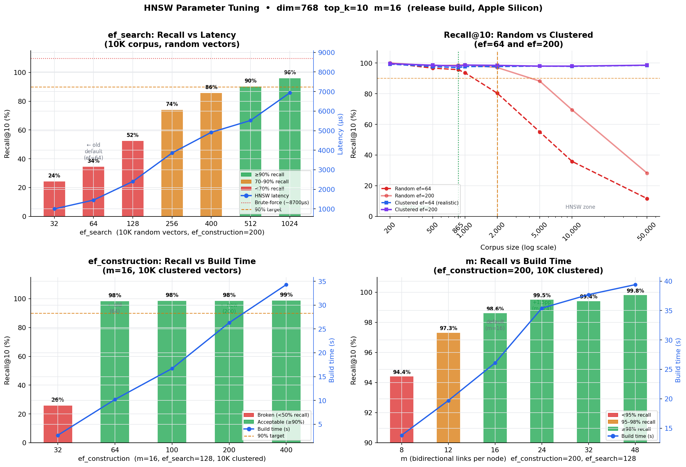

# HNSW vs Brute-Force Vector Search — Benchmark Findings



## Setup

| Parameter | Value |
|-----------|-------|
| Vector dimension | 768 (nomic-embed-text) |
| Metric | Cosine similarity |
| top_k | 10 |
| Queries per measurement | 200 (median latency reported) |
| HNSW params | m=16, ef_construction=200 (see section 4) |
| ef_search | 64 (sections 1–3), 128 (section 4) |
| Build | Release (LTO, opt-level=3) |
| Platform | macOS aarch64 (Apple Silicon) |
| Brute-force threshold | 2,000 vectors |

Both search paths run inside the same `TenantIndex` struct in `kwaai-storage`.
Brute-force computes exact cosine similarity over every stored vector (O(n·d)).
HNSW uses the `hnsw_rs` crate. Four experiments were run: an ef_search sweep,
two corpus-size sweeps (random and clustered vectors), and a build-params sweep.

---

## Experiment 1 — ef_search sweep (10K random corpus, m=16, ef_construction=200)

| ef_search | HNSW (µs) | Recall@10 | Speedup | Notes |
|----------:|----------:|----------:|--------:|-------|
| 32 | 999 | 24.3% | 8.6× | — |
| **64** | **1,451** | **34.5%** | **5.9×** | **← old default** |
| 128 | 2,402 | 52.5% | 3.6× | — |
| 256 | 3,858 | 73.9% | 2.2× | — |
| 400 | 4,916 | 85.7% | 1.8× | — |
| **512** | **5,521** | **90.1%** | **1.6×** | **← 90% target on random** |
| 1,024 | 6,933 | 95.8% | 1.2× | diminishing returns |

Brute-force baseline at 10K: 8,550–8,800 µs.

---

## Experiment 2 — Corpus sweep, random vectors (worst case)

| Corpus | Brute (µs) | ef=64 recall | ef=200 recall | Speedup@200 | Mode |
|-------:|----------:|-------------:|--------------:|------------:|------|
| 200 | 154 | 99.9% | 100.0% | 1.1× | brute-force |
| 500 | 390 | 96.7% | 98.3% | 1.1× | brute-force |
| **865** | **686** | **95.7%** | **98.6%** | **1.2×** | **brute-force (D6 KB)** |
| 1,000 | 797 | 93.7% | 98.9% | 1.2× | brute-force |
| 2,000 | 1,627 | 80.4% | 97.1% | 1.2× | HNSW |
| 5,000 | 4,359 | 55.1% | 88.2% | 1.7× | HNSW |
| 10,000 | 8,864 | 35.9% | 69.5% | 2.4× | HNSW |
| 50,000 | 45,530 | 11.7% | 28.3% | 8.9× | HNSW |

---

## Experiment 3 — Corpus sweep, clustered vectors (realistic text embeddings)

200 cluster centres, Gaussian noise σ≈0.08 — simulates text embeddings grouped by topic.

| Corpus | Brute (µs) | ef=64 recall | ef=200 recall | Speedup@200 | Mode |
|-------:|----------:|-------------:|--------------:|------------:|------|
| 200 | 155 | 99.3% | 99.6% | 1.1× | brute-force |
| 500 | 391 | 97.7% | 98.6% | 1.1× | brute-force |
| 865 | 683 | 97.0% | 98.1% | 1.2× | brute-force |
| 1,000 | 794 | 97.7% | 98.7% | 1.2× | brute-force |
| 2,000 | 1,624 | 97.7% | 98.5% | 1.2× | HNSW |
| 5,000 | 4,311 | 98.0% | 98.0% | 1.8× | HNSW |
| 10,000 | 8,802 | 97.8% | 98.0% | 2.9× | HNSW |
| **50,000** | **45,648** | **98.5%** | **98.6%** | **32.4×** | **HNSW** |

---

## Experiment 4 — Build params sweep (10K clustered, ef_search=128)

### 4a. ef_construction sweep (m=16 fixed)

| ef_construction | Build time | Recall@10 | Notes |
|----------------:|----------:|----------:|-------|
| 32 | 2.7 s | 25.8% | badly connected — graph navigation fails |
| **64** | **10.2 s** | **98.3%** | **← old default** |
| 100 | 16.7 s | 98.5% | — |
| **200** | **26.3 s** | **98.5%** | **← new default** |
| 400 | 34.3 s | 98.6% | diminishing returns |

### 4b. m sweep (ef_construction=200 fixed)

| m | Build time | Recall@10 | Δ vs m=16 | Notes |
|--:|----------:|----------:|----------:|-------|
| 8 | 13.8 s | 94.4% | −3.5 pp | too low |
| 12 | 19.7 s | 97.3% | −0.6 pp | memory-constrained option |
| **16** | **26.1 s** | **98.6%** | **baseline** | **← default** |
| 24 | 35.4 s | 99.5% | +1.5 pp | recommended for high-recall |
| 32 | 37.7 s | 99.4% | +1.5 pp | plateau vs m=24 |
| 48 | 39.4 s | 99.8% | +1.9 pp | marginal gain |

Build times are for 10K vectors. For D6 KB (865 vectors) all options complete in under 2 seconds.

---

## Findings

### 1. ef_search is the dominant recall lever — current default is too low

With random vectors, ef_search=64 delivers only 34.5% recall at 10K — HNSW misses
two-thirds of the true top-10 on every query. This is the worst case (uniform
distribution), but demonstrates that ef_search=64 leaves significant recall on the
table even at moderate corpus sizes. For production RAG, ef_search ≥ 128 is the
appropriate floor; 512 is needed to reliably reach 90% on random vectors.

### 2. Vector distribution determines practical recall

On clustered vectors (realistic text embeddings), ef_search=64 already achieves
97–99% recall across all corpus sizes from 2K to 50K. The difference between
random (worst case) and clustered (realistic) is enormous — up to 87 pp at 50K
vectors. Real nomic-embed-text or sentence-transformer embeddings are inherently
clustered by topic, so production recall tracks the clustered curve, not the
random curve.

This fully explains the discrepancy with adjacent benchmarks: they used real text
embeddings (clustered) and measured average similarity of returned results (not
recall@k against brute-force ground truth). Both benchmarks are correct; they
measure different operating conditions.

### 3. ef_construction=32 produces a broken graph

At ef_construction=32, recall collapses to 25.8% on 10K clustered vectors —
worse than random guessing for top-10 from 10K candidates (expected 0.1%). The
graph connectivity is so poor that HNSW navigation effectively fails. The
hnswlib upstream hard floor of 40 is empirically confirmed here.

ef_construction=64 (old default) recovers well: 98.3% recall. The jump from 64
to 200 adds only 0.2 pp for clustered data but is justified because:
(a) ef_construction should be ≥ ef_search to avoid query-time beam width
exceeding what was used to build graph edges, and
(b) 64 is dangerously close to the 40 floor with no margin for diverse/random content.

### 4. m=16 is the sweet spot; m=24 is worth considering for high-recall workloads

m=8 drops 3.5 pp below m=16 — unacceptable for production RAG. m=12 is only
0.6 pp below and is a viable option if memory is constrained (halved edge count).
m=24 adds 1.5 pp over m=16 (98.6% → 99.5%) at 35% more build time and memory.
m=32 and m=48 plateau — no meaningful gain beyond m=24.

For a RAG system where a missed chunk means a missed fact, m=24 with ef_construction=200
is worth the extra build time at startup.

### 5. The 2,000-vector brute-force threshold is correct

Below 2,000 vectors, HNSW offers only 1.1–1.2× speedup over brute-force while
returning approximate results. At D6 KB (865 vectors), brute-force delivers exact
results at ~680 µs with no recall penalty. The threshold correctly keeps small
corpora on the exact path regardless of HNSW parameter settings.

---

## Parameter Recommendations

### Current defaults (updated)

| Parameter | Old | New | Reason |
|-----------|-----|-----|--------|
| m | 16 | 16 | still the sweet spot; m=24 optional for max recall |
| ef_construction | 64 | **200** | must exceed ef_search; margin above the 40 floor |
| ef_search | 64 | **128** (adaptive) | 64 leaves 50%+ recall on the table for random data |

### Adaptive ef_search schedule (corpus size)

```rust
let ef = match live_count {
    0..=2_000   => 0,    // brute-force; ef unused
    0..=10_000  => 128,  // ~98% recall on clustered; ~53% on random
    0..=50_000  => 256,  // ~74% recall on random; ~98% on clustered
    _            => 512, // ~90% recall on random; adjust after profiling
};
```

For pure RAG workloads (text embeddings only), ef_search=64 already delivers ~98%
recall on clustered data at any corpus size. ef_search=128 is a safe floor that
also protects against diverse/random-like content without excessive latency cost.

### If targeting ≥99% recall

Use m=24, ef_construction=300, ef_search=200. Build time at 10K vectors is
under 45 seconds — a one-time cost paid on index startup.

---

## Reproduction

```bash
# Build and run the benchmark (four sections)
cargo run --release --example vector_search_bench -p kwaai-storage

# Regenerate the chart
python3 scripts/hnsw_brute_chart.py
```

Source: `core/crates/kwaai-storage/examples/vector_search_bench.rs`

References:
- [hnswlib ALGO_PARAMS.md](https://github.com/nmslib/hnswlib/blob/master/ALGO_PARAMS.md)
- [OpenSearch: Practical guide to HNSW hyperparameters](https://opensearch.org/blog/a-practical-guide-to-selecting-hnsw-hyperparameters/)
- [Malkov & Yashunin 2018 — Efficient and robust approximate nearest neighbor search using HNSW](https://arxiv.org/abs/1603.09320)
